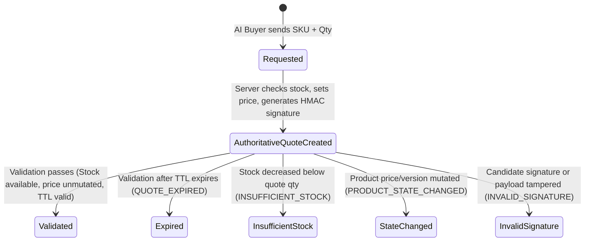

# AgentPay Gateway Architecture Specification

> **Track 01 — AI Growth & Agentic Commerce (Razorpay Buildathon)**  
> **Core Architectural Axiom:** *"The AI proposes; deterministic systems authorize."*

---

## 1. Core Architectural Axiom & Threat Model

The central security tenet of **AgentPay Gateway** is that an LLM / AI buyer agent is an **untrusted proposer**. It may discover products, formulate purchasing strategies, negotiate, and **propose** actions, but it **NEVER directly authorizes or executes financial transactions**.

```text
┌─────────────────────────┐
│     AI Buyer (LLM)      │
└────────────┬────────────┘
             │ 1. Discover products & capabilities (GET /.well-known/agent-catalog.json)
             │ 2. Request Quote with desired SKUs & quantities (POST /agent/cart/quote)
             ▼
┌─────────────────────────┐
│  Server-Authoritative   │ ──> Read prices, stock & versions from Database
│      Quote Engine       │ ──> Calculate Subtotal, Discounts, Total, TTL
└────────────┬────────────┘ ──> Compute SHA-256 HMAC Quote Signature
             │
             ▼
┌─────────────────────────┐
│  Deterministic Policy   │ ──> [Phase 3] Spending caps, SKU whitelist, Merchant trust
│     Gate & Guard        │
└────────────┬────────────┘
             │ Validated & Signed
             ▼
┌─────────────────────────┐
│  Quote Validation &     │ ──> POST /agent/cart/validate
│    Inventory Safety     │ ──> Re-check real-time stock, version & signature integrity
└────────────┬────────────┘
             │
             ▼
┌─────────────────────────┐
│  Razorpay Test Mode     │ ──> [Phase 4] Orders API (LLM has ZERO credential access)
└────────────┬────────────┘
             │ Webhook
             ▼
┌─────────────────────────┐
│  Immutable Audit Ledger │ ──> [Phase 4] Append-only event history
└─────────────────────────┘
```

---

## 2. Server-Authoritative Commerce Protocol (Phase 2)

### Why Signing Alone Is Not Authoritative
In AgentPay Gateway:
1. **The Server Owns State:** Product unit prices, available inventory, currency, quote expiration timestamps, and HMAC secrets live exclusively on the server and within PostgreSQL.
2. **Untrusted Proposer:** The client or LLM requests a quote by submitting only `sku` and `quantity`. If an LLM attempts to submit a price or discount, it is ignored/rejected by schema validation.
3. **Deterministic Canonicalization:** The quote is canonicalized into sorted JSON keys (`build_canonical_quote_dict`) and hashed with `HMAC-SHA256(CART_HMAC_SECRET, canonical_bytes)`.
4. **Stateful Re-Verification:** During validation (`POST /agent/cart/validate`), the server does not merely trust the HMAC signature; it re-checks live database inventory, product active status, and product version stamps to prevent race conditions or purchasing stale/tampered inventory.

---

## 3. Implemented API Endpoints (Phase 1 & Phase 2)

| Endpoint | Method | Purpose | Implementation Status |
|---|---|---|---|
| `/health` | `GET` | Health check probe (`{"status": "ok"}`) | ✅ **Phase 1** |
| `/.well-known/agent-catalog.json` | `GET` | Machine-readable merchant capability manifest | ✅ **Phase 2** |
| `/agent/catalog` | `GET` | Filtered, searchable deterministic product catalog | ✅ **Phase 2** |
| `/agent/products/{sku}` | `GET` | Authoritative single SKU lookup | ✅ **Phase 2** |
| `/agent/cart/quote` | `POST` | Authoritative quote creation & cryptographic HMAC signing | ✅ **Phase 2** |
| `/agent/cart/validate` | `POST` | Real-time quote validation & inventory re-verification | ✅ **Phase 2** |
| `/agent/checkout` | `POST` | Policy-gated Razorpay order creation | ⏳ *Phase 3 / 4 Deferred* |
| `/webhooks/razorpay` | `POST` | Idempotent payment webhook event processor | ⏳ *Phase 4 Deferred* |
| `/ledger/events` | `GET` | Immutable audit trail query API | ⏳ *Phase 4 Deferred* |

---

## 4. Quote Lifecycle & State Transitions



---

## 5. Machine-Readable Failure Codes

When quote validation fails, the response includes explicit machine-readable failure reason codes:
- `QUOTE_NOT_FOUND`: The quote ID does not exist.
- `QUOTE_EXPIRED`: The 15-minute quote TTL has lapsed.
- `INVALID_SIGNATURE`: Cryptographic HMAC SHA-256 verification failed (tampering detected).
- `INSUFFICIENT_STOCK`: Real-time stock is less than quoted quantity.
- `PRODUCT_UNAVAILABLE`: Product deactivated or deleted.
- `PRODUCT_STATE_CHANGED`: Authoritative price or version changed since quote creation.
