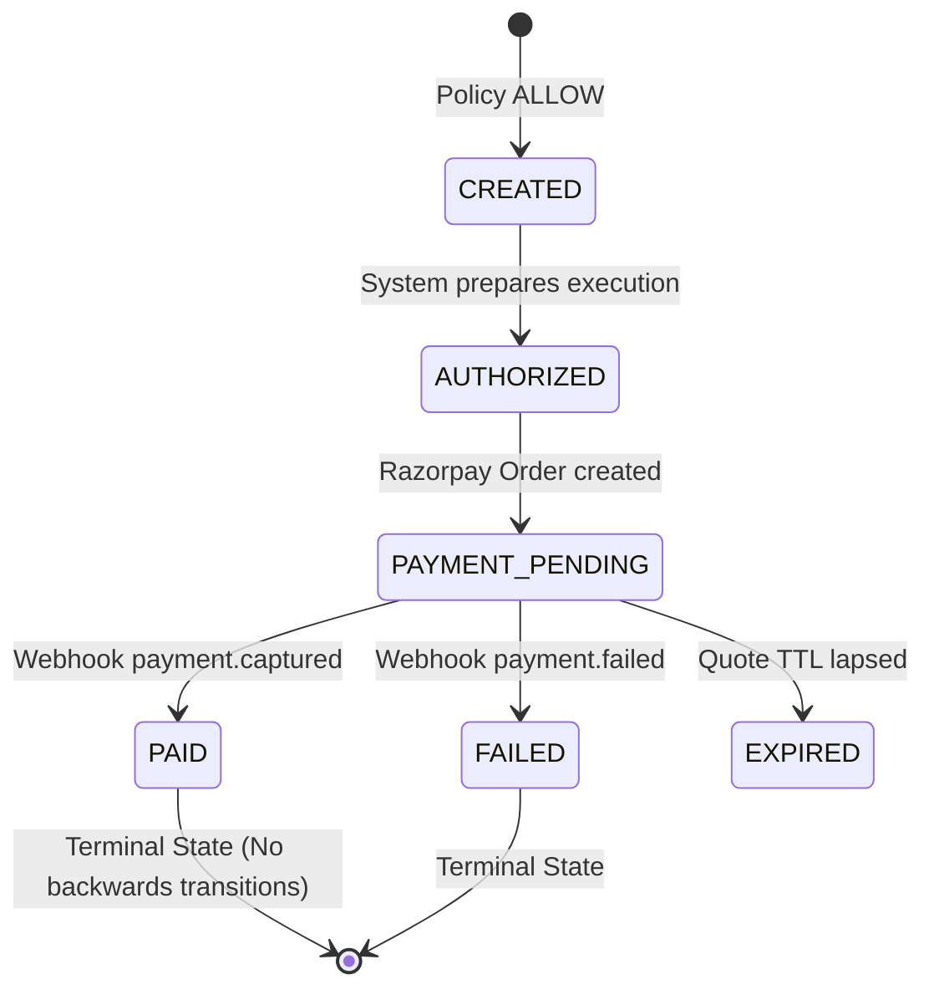

# AgentPay Gateway Architecture Specification

> **Track 01 — AI Growth & Agentic Commerce (Razorpay Buildathon)**  
> **Core Architectural Axiom:** *"The AI proposes; deterministic systems authorize; Razorpay executes."*

---

## 1. System Topology & Action Boundaries

```text
┌─────────────────────────────────────────────────────────────┐
│                   PROPOSAL LAYER (LLM)                      │
│ - Product discovery                                         │
│ - Cart item & quantity selection                            │
│ - Requests quote (POST /agent/cart/quote)                   │
│ - Has ZERO access to payment credentials or direct checkout │
└──────────────────────────────┬──────────────────────────────┘
                               │
                               ▼
┌─────────────────────────────────────────────────────────────┐
│             AUTHORITATIVE QUOTE & STATE LAYER               │
│ - Reads authoritative prices & live stock from Database     │
│ - Calculates Subtotal, Discounts, Total (Integer Paise)     │
│ - Generates HMAC-SHA256 Quote Signature                     │
│ - Evaluates 15-minute Quote TTL                             │
└──────────────────────────────┬──────────────────────────────┘
                               │
                               ▼
┌─────────────────────────────────────────────────────────────┐
│                 DETERMINISTIC POLICY GATE                   │
│ - Evaluates server-authoritative Quote vs. Policy Rules     │
│ - Zero natural language / LLM overrides permitted           │
│ - Fail-Closed: any error or missing entity -> BLOCK         │
│ - Outputs: ALLOW | BLOCK | REQUIRE_CONFIRMATION             │
└──────────────────────────────┬──────────────────────────────┘
                               │ ALLOW
                               ▼
┌─────────────────────────────────────────────────────────────┐
│       FINANCIAL EXECUTION LAYER (Razorpay Test Mode)        │
│ - POST /agent/checkout/execute (Only quote_id accepted)     │
│ - Creates Transaction record in CREATED status              │
│ - Creates Razorpay Test Mode Order via Orders API           │
│ - Transitions status to PAYMENT_PENDING                     │
└──────────────────────────────┬──────────────────────────────┘
                               │ Webhook (payment.captured)
                               ▼
┌─────────────────────────────────────────────────────────────┐
│          IDEMPOTENT WEBHOOK & STATE MACHINE                 │
│ - POST /webhooks/razorpay                                   │
│ - Verifies HMAC-SHA256 Razorpay Webhook Signature           │
│ - Validates amount, currency & legal state transition       │
│ - Idempotently updates Transaction status to PAID           │
└──────────────────────────────┬──────────────────────────────┘
                               │
                               ▼
┌─────────────────────────────────────────────────────────────┐
│         IMMUTABLE TAMPER-EVIDENT AUDIT LEDGER               │
│ - Append-only cryptographic SHA-256 hash-chained trail      │
│ - GET /ledger/events & GET /ledger/verify-chain             │
│ - Detects payload tampering, deletion, or reordering        │
└─────────────────────────────────────────────────────────────┘
```

---

## 2. Financial Action Execution Flow (Phase 4 Active)

1. **Execution Request:** Caller provides only `quote_id` (`POST /agent/checkout/execute`). No client-supplied prices, totals, or currencies are accepted.
2. **Idempotency Gate:** If a transaction already exists for the quote ID, the existing transaction is returned without creating duplicate Razorpay orders.
3. **Deterministic Policy Check:** The quote is validated against cryptographic signatures, live inventory, active status, and spending policies.
   - If `BLOCK` $\rightarrow$ stops immediately; Razorpay is **never** invoked.
   - If `REQUIRE_CONFIRMATION` $\rightarrow$ execution holds; Razorpay is **never** invoked.
   - If `ALLOW` $\rightarrow$ transaction is created in `CREATED` status.
4. **Razorpay Orders API:** An order is created in Razorpay Test Mode using the authoritative database amount in integer paise. The transaction transitions to `PAYMENT_PENDING`.
5. **Webhook Lifecycle:** Razorpay sends `payment.captured` or `payment.failed`. The webhook endpoint verifies HMAC signatures, ensures amount and currency consistency, and transitions transaction status to `PAID` or `FAILED`.
6. **Tamper-Evident Audit Ledger:** Every state transition and decision produces a hash-chained `AuditEvent` (`previous_event_hash` $\rightarrow$ `event_hash`).

---

## 3. Transaction State Machine



---

## 4. API Endpoints (Phase 1, 2, 3, & 4)

| Endpoint | Method | Purpose | Implementation Status |
|---|---|---|---|
| `/health` | `GET` | Health check probe (`{"status": "ok"}`) | ✅ **Phase 1** |
| `/.well-known/agent-catalog.json` | `GET` | Machine-readable merchant capability manifest | ✅ **Phase 2** |
| `/agent/catalog` | `GET` | Filtered, searchable deterministic product catalog | ✅ **Phase 2** |
| `/agent/products/{sku}` | `GET` | Authoritative single SKU lookup | ✅ **Phase 2** |
| `/agent/cart/quote` | `POST` | Authoritative quote creation & cryptographic HMAC signing | ✅ **Phase 2** |
| `/agent/cart/validate` | `POST` | Real-time quote validation & inventory re-verification | ✅ **Phase 2** |
| `/agent/policy/evaluate` | `POST` | Deterministic policy evaluation of authoritative quotes | ✅ **Phase 3** |
| `/agent/policy/{policy_id}` | `GET` | Read active policy configuration | ✅ **Phase 3** |
| `/agent/checkout/execute` | `POST` | Razorpay order creation (only after ALLOW) | ✅ **Phase 4** |
| `/webhooks/razorpay` | `POST` | Idempotent payment webhook event processor | ✅ **Phase 4** |
| `/ledger/events` | `GET` | Immutable audit trail query API | ✅ **Phase 4** |
| `/ledger/verify-chain` | `GET` | Cryptographic audit hash chain integrity verification | ✅ **Phase 4** |
| `/agent/chat` | `POST` | LangGraph AI Buyer autonomous loop | ⏳ *Phase 5 Deferred* |
