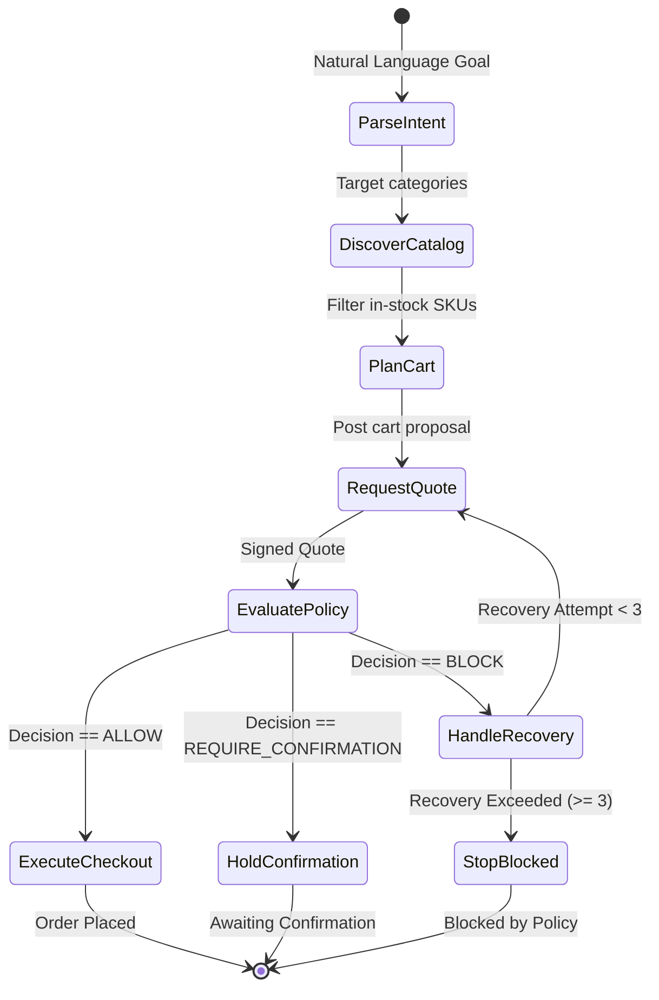

# AgentPay Gateway Architecture Specification

> **Track 01 — AI Growth & Agentic Commerce (Razorpay Buildathon)**  
> **Core Architectural Axiom:** *"The AI proposes; deterministic systems authorize; Razorpay executes."*

---

## 1. System Topology & Action Boundaries

```text
┌─────────────────────────────────────────────────────────────┐
│                 AUTONOMOUS AI BUYER (LangGraph)             │
│ - Natural language purchase intent parsing                  │
│ - Agent-readable catalog discovery & SKU inspection         │
│ - Cart proposal formulation & bounded autonomous recovery   │
│ - Requests authoritative quote (POST /agent/cart/quote)     │
│ - ZERO direct access to Razorpay API or payment credentials │
└──────────────────────────────┬──────────────────────────────┘
                               │
                               ▼
┌─────────────────────────────────────────────────────────────┐
│             AUTHORITATIVE QUOTE & STATE LAYER               │
│ - Reads authoritative prices & live stock from Database     │
│ - Calculates Subtotal, Discounts, Total (Integer Paise)     │
│ - Generates HMAC-SHA256 Quote Signature                     │
│ - Evaluates 15-minute Quote TTL                             │
└──────────────────────────────┬──────────────────────────────┘
                               │
                               ▼
┌─────────────────────────────────────────────────────────────┐
│                 DETERMINISTIC POLICY GATE                   │
│ - Evaluates server-authoritative Quote vs. Policy Rules     │
│ - Zero natural language / LLM overrides permitted           │
│ - Fail-Closed: any error or missing entity -> BLOCK         │
│ - Outputs: ALLOW | BLOCK | REQUIRE_CONFIRMATION             │
└──────────────────────────────┬──────────────────────────────┘
                               │ ALLOW
                               ▼
┌─────────────────────────────────────────────────────────────┐
│       FINANCIAL EXECUTION LAYER (Razorpay Test Mode)        │
│ - POST /agent/checkout/execute (Only quote_id accepted)     │
│ - Creates Transaction record in CREATED status              │
│ - Creates Razorpay Test Mode Order via Orders API           │
│ - Transitions status to PAYMENT_PENDING                     │
└──────────────────────────────┬──────────────────────────────┘
                               │ Webhook (payment.captured)
                               ▼
┌─────────────────────────────────────────────────────────────┐
│          IDEMPOTENT WEBHOOK & STATE MACHINE                 │
│ - POST /webhooks/razorpay                                   │
│ - Verifies HMAC-SHA256 Razorpay Webhook Signature           │
│ - Validates amount, currency & legal state transition       │
│ - Idempotently updates Transaction status to PAID           │
└──────────────────────────────┬──────────────────────────────┘
                               │
                               ▼
┌─────────────────────────────────────────────────────────────┐
│         IMMUTABLE TAMPER-EVIDENT AUDIT LEDGER               │
│ - Append-only cryptographic SHA-256 hash-chained trail      │
│ - GET /ledger/events & GET /ledger/verify-chain             │
│ - Detects payload tampering, deletion, or reordering        │
└─────────────────────────────────────────────────────────────┘
```

---

## 2. Autonomous AI Buyer LangGraph State Machine (Phase 5 Active)



---

## 3. Complete API Specification

| Endpoint | Method | Purpose | Implementation Status |
|---|---|---|---|
| `/health` | `GET` | Health check probe (`{"status": "ok"}`) | ✅ **Phase 1** |
| `/.well-known/agent-catalog.json` | `GET` | Machine-readable merchant capability manifest | ✅ **Phase 2** |
| `/agent/catalog` | `GET` | Filtered, searchable deterministic product catalog | ✅ **Phase 2** |
| `/agent/products/{sku}` | `GET` | Authoritative single SKU lookup | ✅ **Phase 2** |
| `/agent/cart/quote` | `POST` | Authoritative quote creation & cryptographic HMAC signing | ✅ **Phase 2** |
| `/agent/cart/validate` | `POST` | Real-time quote validation & inventory re-verification | ✅ **Phase 2** |
| `/agent/policy/evaluate` | `POST` | Deterministic policy evaluation of authoritative quotes | ✅ **Phase 3** |
| `/agent/policy/{policy_id}` | `GET` | Read active policy configuration | ✅ **Phase 3** |
| `/agent/checkout/execute` | `POST` | Razorpay order creation (only after ALLOW) | ✅ **Phase 4** |
| `/webhooks/razorpay` | `POST` | Idempotent payment webhook event processor | ✅ **Phase 4** |
| `/ledger/events` | `GET` | Immutable audit trail query API | ✅ **Phase 4** |
| `/ledger/verify-chain` | `GET` | Cryptographic audit hash chain integrity verification | ✅ **Phase 4** |
| `/agent/buy` | `POST` | Autonomous AI Buyer purchase execution endpoint | ✅ **Phase 5** |
| `/agent/runs` | `GET` | List past AI Buyer runs for Inspector Dashboard | ✅ **Phase 5** |
| `/agent/runs/{run_id}` | `GET` | Retrieve detailed node-by-node execution trace | ✅ **Phase 5** |
