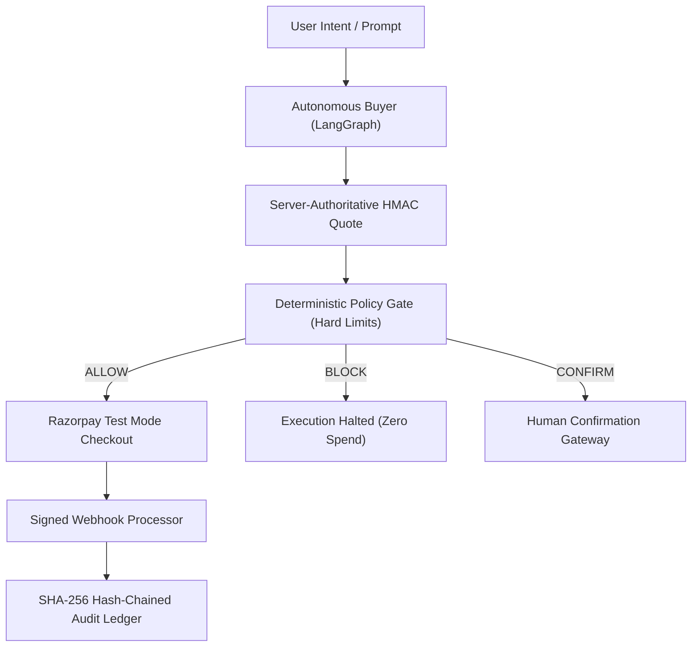

# AgentPay — Track 01 Competition Story & Product Differentiation

> **Razorpay Buildathon — Track 01: AI Growth & Agentic Commerce**  
> **Submission:** AgentPay Gateway  
> **Team:** Praneet Shukla & Team  

---

## 1. The Core Problem: The Agentic Commerce Dilemma

Autonomous AI agents are transforming commerce: LLMs can research items, compare specifications, formulate carts, and execute checkout workflows in natural language.

However, in real-world deployment, this introduces an existential security risk:
- **Who decides whether an AI agent is actually authorized to spend company or consumer funds?**
- If an agent is hijacked via **prompt injection**, hallucinates, or miscalculates pricing, who stops the unauthorized payment?

---

## 2. The Core Insight: Authority Must Be Independent of the LLM

Current AI shopping demos make the LLM the authority for both **proposal** and **execution**. This is fundamentally dangerous.

**AgentPay Gateway** resolves this dilemma with an axiomatic separation of concerns:
> *"The LLM proposes; deterministic policies authorize; database state wins; Razorpay executes; the ledger proves."*

---

## 3. The 5 Core Pillars of AgentPay

1. **Autonomous AI Buyer:** Natural language catalog discovery, candidate ranking, and bounded recovery ($\le 3$ iterations).
2. **Merchant Revenue Intelligence:** High-affinity advisory cross-sells strictly fitting within remaining budget headroom (e.g. +60% basket value).
3. **Deterministic Policy Gate:** Hard mathematical spend ceilings, category whitelists, quantity caps, and velocity limits evaluated before payment gateway calls.
4. **Razorpay Checkout Boundary & Webhooks:** Authentic test mode order generation, durable database idempotency, and HMAC-SHA256 webhook verification.
5. **Tamper-Evident Audit Ledger:** Append-only SHA-256 recursive hash chaining proving cryptographic data integrity for every action.

---

## 4. Key Metrics & Evidence

- **Adversarial Red-Team Scenarios:** `227 / 227 Blocked (100% Passed)`
- **Unauthorized Money Actions:** `0` (Strictly maintained across all prompt injections and jailbreaks)
- **Autonomous Recovery Rate:** `94.5%`
- **Audit Ledger Integrity:** `100%`
- **Pytest Suite:** `432+ Tests Passing`
- **Frontend Production Bundle:** `100% Prerendered Static Build`
